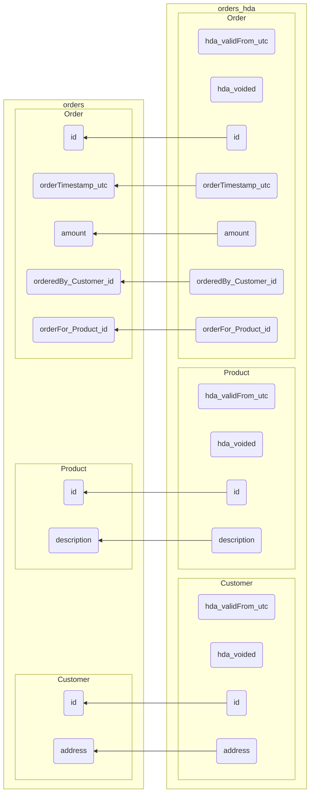

# Lineage

The code in this file is automatically generated @ 2023-12-14 15:08:26.217017.
Manual changes to this file will be removed when this file is regenerated.

# HDA lineage

```mermaid
graph RL
subgraph orders [orders]

subgraph orders.Customer [Customer]

  
  
  orders.Customer.id(id)
  orders.Customer.address(address)
  

end
subgraph orders.Product [Product]

  
  
  orders.Product.id(id)
  orders.Product.description(description)
  

end
subgraph orders.Order [Order]

  
  
  orders.Order.id(id)
  orders.Order.orderTimestamp_utc(orderTimestamp_utc)
  orders.Order.amount(amount)
  orders.Order.orderedBy_Customer_id(orderedBy_Customer_id)
  orders.Order.orderFor_Product_id(orderFor_Product_id)
  

end
end

subgraph  orders_hda [orders_hda]

subgraph orders_hda.Customer [Customer]

  orders_hda.Customer.hda_validFrom_utc(hda_validFrom_utc)
  orders_hda.Customer.hda_voided(hda_voided)
  orders_hda.Customer.id(id)
  orders_hda.Customer.address(address)
  

end
subgraph orders_hda.Product [Product]

  orders_hda.Product.hda_validFrom_utc(hda_validFrom_utc)
  orders_hda.Product.hda_voided(hda_voided)
  orders_hda.Product.id(id)
  orders_hda.Product.description(description)
  

end
subgraph orders_hda.Order [Order]

  orders_hda.Order.hda_validFrom_utc(hda_validFrom_utc)
  orders_hda.Order.hda_voided(hda_voided)
  orders_hda.Order.id(id)
  orders_hda.Order.orderTimestamp_utc(orderTimestamp_utc)
  orders_hda.Order.amount(amount)
  orders_hda.Order.orderedBy_Customer_id(orderedBy_Customer_id)
  orders_hda.Order.orderFor_Product_id(orderFor_Product_id)
  

end
end


orders_hda.Customer.id-->orders.Customer.id(id)
orders_hda.Customer.address-->orders.Customer.address(address)


orders_hda.Product.id-->orders.Product.id(id)
orders_hda.Product.description-->orders.Product.description(description)


orders_hda.Order.id-->orders.Order.id(id)
orders_hda.Order.orderTimestamp_utc-->orders.Order.orderTimestamp_utc(orderTimestamp_utc)
orders_hda.Order.amount-->orders.Order.amount(amount)
orders_hda.Order.orderedBy_Customer_id-->orders.Order.orderedBy_Customer_id(orderedBy_Customer_id)
orders_hda.Order.orderFor_Product_id-->orders.Order.orderFor_Product_id(orderFor_Product_id)

```

